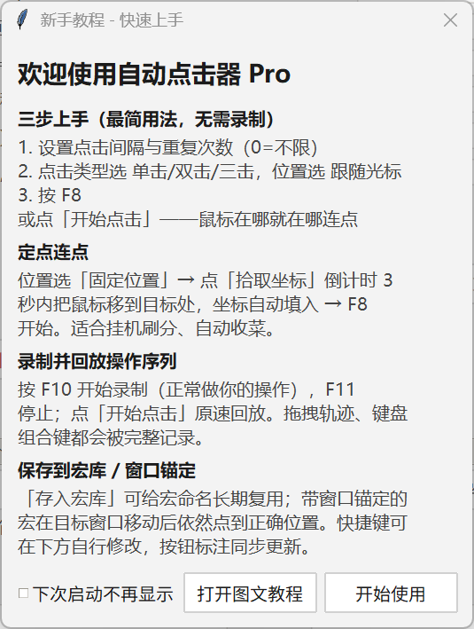
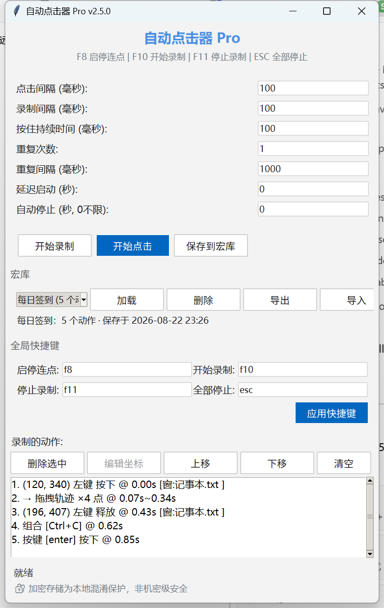
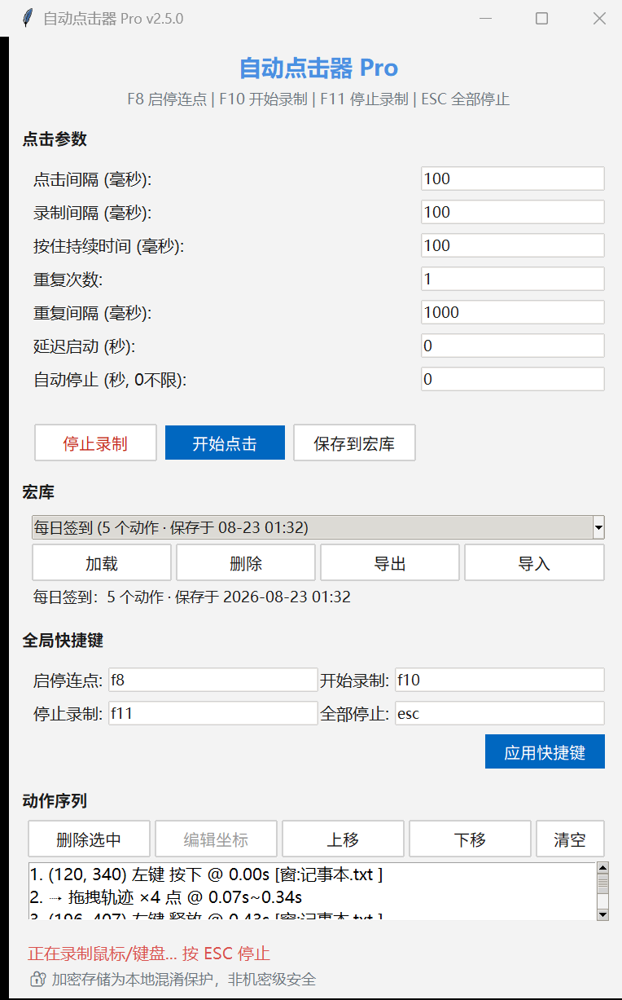
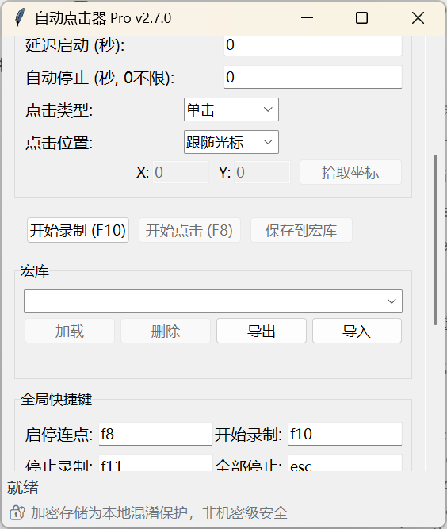

# 自动点击器 Pro · 新手教程

> 5 分钟上手：**不录制也能连点** → 录制回放 → 存进宏库。进阶玩法见文末。
> 首次启动软件会自动弹出快速上手弹窗（可勾选"不再显示"），点标题栏"新手教程"随时重看：

---

## 一、安装与启动

| 方式 | 步骤 |
|---|---|
| 直接使用（推荐） | 到 [Releases](https://github.com/2002yy/AutoClicker-Pro/releases) 下载 `AutoClickerPro_Windows.zip` → 解压 → 双击 `AutoClickerPro.exe` |
| 源码运行 | `pip install -r requirements.txt` → `python main.py` |

*（截图占位：主窗口全貌，标注 1-设置区 / 2-控制按钮 / 3-宏库 / 4-快捷键区 / 5-动作列表）*

---

## 二、30 秒上手：最简单的连点（无需录制）

1. **设参数**：点击间隔填 `100`（毫秒）、重复次数填 `0`（不限，手动停）
2. **选位置**：默认"跟随光标"——鼠标在哪就在哪点；或选"固定位置"→ 点**拾取坐标**，3 秒内把鼠标移到目标处，坐标自动填入
3. **开跑**：按 `F8` 启动；再按 `F8` 或 `ESC` 停止。双击/三击场景把"点击类型"切到对应档位即可

---

## 二·五、录制并回放操作序列

需要"一连串不同位置的操作"时才用录制：

1. 按 `F10` 开始录制（状态栏实时显示光标坐标），正常做你的操作
2. 按 `F11` 或 `ESC` 停止；动作列表逐条列出点击/按键/拖拽
3. 点"开始点击"按**录制时的真实节奏**原速回放；满意后"保存到宏库"长期复用

---

## 三、界面导览

### 设置区
| 项目 | 含义 |
|---|---|
| 点击间隔 | 内置连点模式下两次点击的间隔；序列回放时仅对无时间戳的序列生效（录制的序列按原速回放） |
| 按住持续时间 | 单独按下动作的按压时长 |
| 重复次数 | 内置连点=点击事件总数；序列回放=整个序列播放几轮；**0=无限** |
| 轮次间隔 | 两轮之间的等待（毫秒） |
| 延迟启动 | 点"开始点击"后倒计时再跑，等待期可随时取消 |
| 自动停止 | 整次运行的最长时长，0 = 不限时 |
| 点击类型 | 单击 / 双击 / 三击（内置连点模式生效） |
| 点击位置 | 跟随光标（在哪点哪）/ 固定位置 + 拾取坐标（倒计时 3 秒抓取光标位置） |

### 宏库面板
- **保存到宏库**（主按钮）：弹窗输名字，一键入库。重名会询问是否覆盖
- 下拉框显示每个宏的**动作数与保存时间**
- **加载**：把库里的宏载入编辑区　**删除**：移除（需确认）
- **导出 / 导入**：与任意位置的 `.enc` 文件交换（比如发给同事）

### 动作列表
- 录制中的每一下点击/按键实时列出；连续拖拽轨迹折叠为一行 `⇢ 拖拽轨迹 ×N 点`
- 支持删除选中 / 上移 / 下移 / 清空；折叠轨迹可整段删除
- 选中单个鼠标或移动动作后可用**编辑坐标**微调落点

### 窗口太小时？
内容区自动出现**竖向滚动条**，鼠标滚轮在界面任意位置即可上下滑动；
状态栏始终固定在底部，不会被挡住。

---

## 四、快捷键

默认如下，均可在"全局快捷键"区修改并自动保存：

| 键 | 功能 |
|---|---|
| `F8` | 开始 / 停止连点 |
| `F10` | 开始录制 |
| `F11` | 停止录制 |
| `ESC` | 一键全停 |

> 窗口在后台时同样生效。与其他软件冲突时改成组合键如 `ctrl+shift+f9`。

---

## 五、进阶玩法

### 窗口锚定（推荐开启心智）
录制时会自动记住每次点击所在窗口。之后即使窗口挪了位置，回放依然点得准。
动作列表里带 `[窗:标题]` 标记的动作即锚定动作；目标窗口没开时会退回绝对坐标并在状态栏提示。

### 组合键与拖拽
- `Ctrl+C`、`Shift+单击` 这类操作会被识别为一个整体动作，回放完整还原
- 拖拽会录制移动轨迹并以原速平滑重演（不是瞬移）

### 定时场景举例
- "10 秒后自动开始，跑满 60 秒停"：延迟启动=`10`、自动停止=`60`、重复次数设大一些

---

## 六、常见问题 FAQ

<b>杀毒软件报毒 / SmartScreen 拦截，怎么办？</b>

这是误报。本程序包含键盘钩子、输入模拟和 PyInstaller 加壳三个特征，
几乎必然触发杀软启发式规则。处理方式（按省事程度排序）：

1. 校验下载包 SHA256 与 Release 页公布的值一致后，添加信任/放行
2. 不放心可直接源码运行：`pip install -r requirements.txt && python main.py`
3. 向杀软厂商申诉白名单（详见 [PUBLISHING.md](PUBLISHING.md) 签名章节）

本程序**无网络通信、无遥测**，可自行审计源码验证。

<b>点了开始却没反应？</b>

- 动作列表是空的 → 先录制（F10）或从宏库加载
- 设置了很长的"延迟启动" → 状态栏有倒计时提示，等待或按 ESC 取消
- 目标窗口以管理员权限运行而本程序不是 → 右键"以管理员身份运行"

<b>换分辨率 / 多显示器后点击位置不对？</b>

v2.2.0 起带窗口锚定，正常情况自动适配。若个别动作仍偏移：
该动作可能录制于无标题窗口（锚定失败），重新录制即可。

<b>宏文件在哪里？能分享给别人吗？</b>

宏库存放在 `C:\Users\<你>\.autoclicker_pro\macros\*.enc`（加密格式）。
用面板的"导出"另存为文件发给别人，对方用"导入"即可。

<b>可以用于游戏吗？</b>

技术上可行，但**违反绝大多数游戏的服务条款**，可能导致封号。详见 README 的
[合法使用与免责声明](../README.md#️-合法使用与免责声明)。请仅用于办公自动化、UI 测试与无障碍辅助等合规场景。

---

## 七、故障排查清单

| 现象 | 排查 |
|---|---|
| 启动闪退 | 杀软隔离了文件；先恢复并加信任 |
| 快捷键无效 | 其他软件占用了同键位 → 界面里改键；远程桌面环境可能无法注册全局钩子（状态栏会提示降级） |
| 点击位置漂移 | 关闭显示器缩放变化后重录；确认锚定窗口标题未被修改 |
| 回放节奏太快/太慢 | 有时间戳的序列按原速播放属正常；想改节奏可调整"轮次间隔"或重新录制 |
